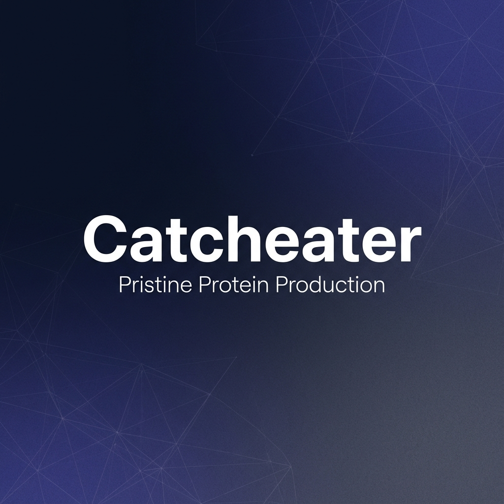

# Catcheater | Pristine Protein Production

**The first tag-less quality control system for industrial fermentation.**



## Overview

Catcheater is a biotech startup developing an autonomous genetic circuit that eliminates "cheater" cells in E. coli fermentation. By coupling protein production to cell survival, we enable antibiotic-free, stable, and high-yield biomanufacturing.

This repository contains the source code for the Catcheater landing page and customer portal.

## Tech Stack

- **Framework:** [Next.js 15 (App Router)](https://nextjs.org/)
- **Styling:** [Tailwind CSS](https://tailwindcss.com/)
- **Animations:** [Framer Motion](https://www.framer.com/motion/)
- **Icons:** [Lucide React](https://lucide.dev/)
- **Deployment:** [Vercel](https://vercel.com/)

## Key Features

- **Interactive Science Deep Dive:** Visualizing the "Snitch & Enforcer" mechanism.
- **Dynamic Order Form:** Configuration wizard for custom plasmid orders.
- **Market Survey:** Typeform-style engaging survey for customer discovery.
- **Dashboard:** Customer portal for kit management (Prototype).
- **Responsive Design:** Fully optimized for mobile and desktop.

## Getting Started

First, run the development server:

```bash
npm run dev
# or
yarn dev
# or
pnpm dev
# or
bun dev
```

Open [http://localhost:3000](http://localhost:3000) with your browser to see the result.

## Project Structure

- `src/app`: Page routes and layouts (App Router).
- `src/components`: Reusable UI components.
  - `sections`: Full-page sections (Hero, Features, etc.).
  - `ui`: Low-level design system elements.
- `public`: Static assets (images, logos).

## Learn More

To learn more about Next.js, take a look at the following resources:

- [Next.js Documentation](https://nextjs.org/docs) - learn about Next.js features and API.
- [Learn Next.js](https://nextjs.org/learn) - an interactive Next.js tutorial.

---

© 2024 Catcheater. All Rights Reserved.

First, run the development server:

```bash
npm run dev
# or
yarn dev
# or
pnpm dev
# or
bun dev
```

Open [http://localhost:3000](http://localhost:3000) with your browser to see the result.

You can start editing the page by modifying `app/page.tsx`. The page auto-updates as you edit the file.

This project uses [`next/font`](https://nextjs.org/docs/app/building-your-application/optimizing/fonts) to automatically optimize and load [Geist](https://vercel.com/font), a new font family for Vercel.

## Learn More

To learn more about Next.js, take a look at the following resources:

- [Next.js Documentation](https://nextjs.org/docs) - learn about Next.js features and API.
- [Learn Next.js](https://nextjs.org/learn) - an interactive Next.js tutorial.

You can check out [the Next.js GitHub repository](https://github.com/vercel/next.js) - your feedback and contributions are welcome!

## Deploy on Vercel

The easiest way to deploy your Next.js app is to use the [Vercel Platform](https://vercel.com/new?utm_medium=default-template&filter=next.js&utm_source=create-next-app&utm_campaign=create-next-app-readme) from the creators of Next.js.

Check out our [Next.js deployment documentation](https://nextjs.org/docs/app/building-your-application/deploying) for more details.
